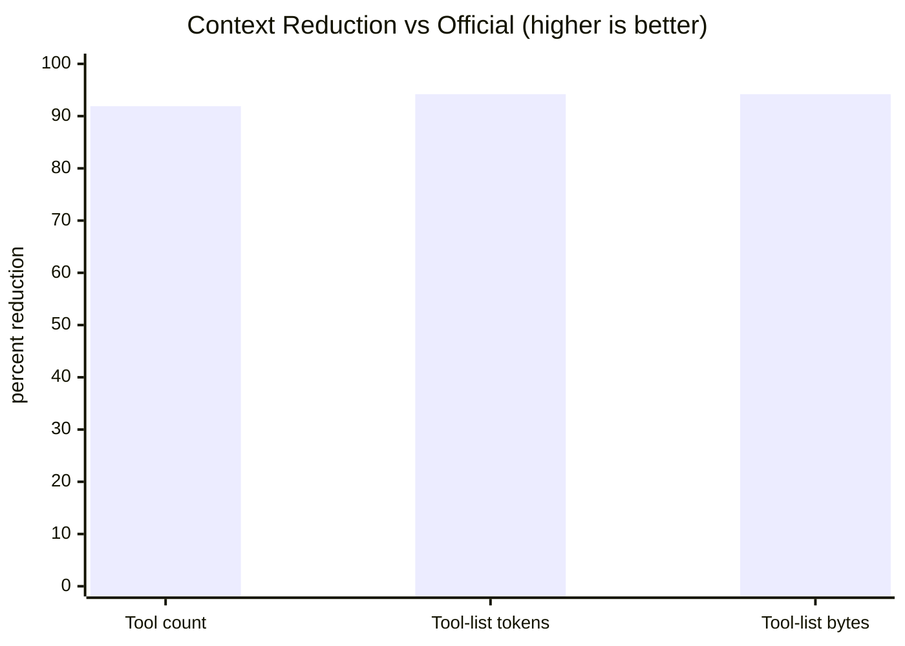
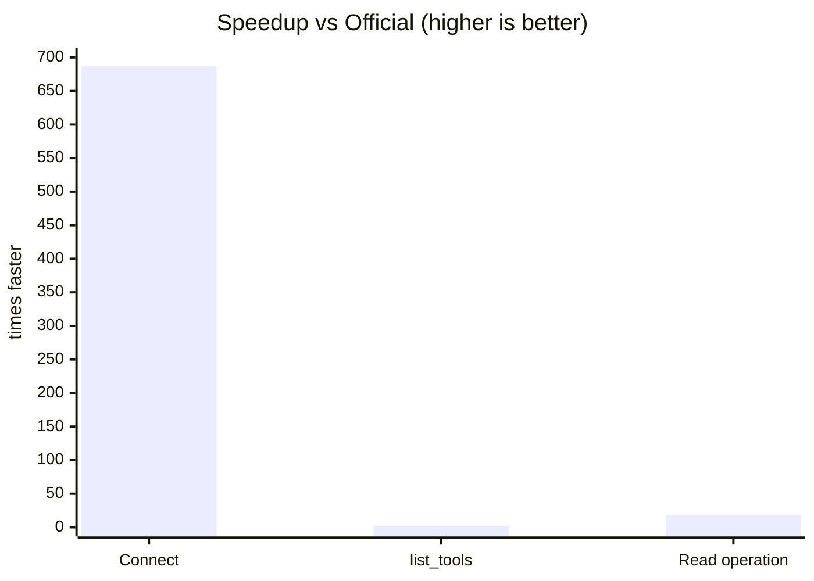

# Heroku Code MCP

> A token-efficient MCP server for the Heroku Platform API using a Code Mode pattern: `search` + `execute` + `auth_status`.

Design references:
- [Cloudflare Code Mode MCP](https://blog.cloudflare.com/code-mode-mcp/)
- [Anthropic: Building Effective Agents (advanced tool use)](https://www.anthropic.com/engineering/building-effective-agents)

## Context Comparison

| Approach | Tool surface | Approx context cost at tool-list time | Fits in a 200k-token context window? |
| --- | --- | --- | --- |
| `heroku mcp:start` (official) | 37 endpoint-oriented tools | ~6,375 tokens | Yes, but consumes meaningful budget up front |
| `heroku-code-mcp` (this repo) | 3 control tools (`search`, `execute`, `auth_status`) | ~368 tokens | Yes, with minimal up-front overhead |

The practical impact is that the agent starts with a much smaller tool schema, then asks the server for just-in-time endpoint discovery. This keeps prompt budget available for user intent, planning, and response quality instead of spending it on static endpoint metadata.

## The Problem

Heroku’s API surface is broad, and an endpoint-per-tool MCP model makes the agent choose between many tools before it has enough task context. That usually increases tool-selection ambiguity, consumes tokens early, and makes multi-step tasks more brittle. The issue is not that many tools are inherently bad, but that model context is scarce and endpoint selection is an agent planning problem, not just a transport problem.

## The Approach

This server applies a Code Mode-style control loop with deterministic inputs:

1. `search` maps natural language intent to ranked `operation_id` candidates.
2. `execute` validates and performs the selected Heroku API operation.
3. `auth_status` provides explicit auth state so agents can branch cleanly.

The server holds schema intelligence and safety policy centrally. The agent gets a small control surface and a stable execution contract.

## Tools

| Tool | What it does | Why it exists |
| --- | --- | --- |
| `search` | Ranks Heroku operations from schema + docs context | Reduces endpoint selection ambiguity |
| `execute` | Validates params/body and executes by `operation_id` | Gives one deterministic execution path |
| `auth_status` | Returns `{authenticated, scopes, expires_at}` | Supports explicit auth-aware planning |

```text
Agent                           MCP Server
  │                                  │
  ├──search({query: "list apps"})──►│ rank operations from catalog/index
  │◄──[GET /apps, ...]───────────────│
  │                                  │
  ├──execute({operation_id: ...})───►│ validate + call Heroku API
  │◄──{status, headers, body}────────│
```

## Benchmark Highlights

Benchmarks were captured on February 22, 2026 on the same machine and account for both implementations. The numbers below compare this repo’s local HTTP MCP endpoint against `heroku mcp:start` over stdio.

### Raw Comparison

| Metric | `heroku-code-mcp` | `heroku mcp:start` | Delta |
| --- | ---: | ---: | ---: |
| Tool count | 3 | 37 | 91.9% lower |
| Tool-list payload bytes | 1,469 | 25,500 | 94.2% lower |
| Tool-list approx tokens | 368 | 6,375 | 94.2% lower |
| Connect avg | 14.8 ms | 10,168.7 ms | 687x faster |
| `list_tools` avg | 4.3 ms | 10.3 ms | 2.4x faster |
| Read op avg | 528.0 ms (`execute GET /apps`) | 9,697.4 ms (`list_apps`) | 18.4x faster |

### Readable Comparison Graphs

```mermaid
xychart-beta
    title "Absolute Latency (ms, lower is better)"
    x-axis ["Connect", "list_tools", "Read operation"]
    y-axis "ms" 0 --> 10500
    bar "heroku-code-mcp" [14.8, 4.3, 528.0]
    bar "heroku mcp:start" [10168.7, 10.3, 9697.4]
```







### How to Read These Results

The strongest win is context footprint. A 3-tool interface materially lowers initial prompt overhead and reduces tool-choice branching for the model. The second win is connection and read-path latency under this benchmark harness. In measured runs, `heroku mcp:start` paid a much larger connect-time cost, and its measured read operation was substantially slower than `execute GET /apps` on this server.

This does not mean every endpoint in every environment will always have the same multiplier. It means the measured default experience in this setup favored the Code Mode control surface for both context economy and latency.

## Benchmark Methodology

- Date: February 22, 2026.
- Environment: same local machine, same Heroku account, warm network.
- Custom server run count: 10.
- Official server run count: 3.
- Context estimate: `ceil(list_tools_json_bytes / 4)` for rough token approximation.
- Read comparison pairing:
  - Custom: `execute GET /apps`
  - Official: `list_apps`

Artifacts:
- `/Users/anush.dsouza/startup/Aura12/work/codemode/heroku/benchmarks/results/context-footprint-2026-02-22.json`
- `/Users/anush.dsouza/startup/Aura12/work/codemode/heroku/benchmarks/results/custom-local-http-2026-02-22.json`
- `/Users/anush.dsouza/startup/Aura12/work/codemode/heroku/benchmarks/results/official-heroku-mcp-start-2026-02-22.json`
- `/Users/anush.dsouza/startup/Aura12/work/codemode/heroku/BENCHMARKS.md`

## Get Started

MCP URL: `http://127.0.0.1:3000/mcp`

```bash
cd /Users/anush.dsouza/startup/Aura12/work/codemode/heroku
npm install
npm run build
npm test
```

### Option 1: OAuth (Recommended)

Configure OAuth env vars and use `/oauth/start` + `/oauth/callback`.

### Option 2: Local token seeding from Heroku CLI

```bash
heroku auth:whoami
npm run seed:token
```

Start server:

```bash
TOKEN_STORE_PATH=./data/tokens.integration.json \
TOKEN_ENCRYPTION_KEY_BASE64='<seed-output-key>' \
PORT=3000 HOST=127.0.0.1 npm run dev
```

Smoke test:

```bash
curl -sS http://127.0.0.1:3000/healthz
MCP_URL=http://127.0.0.1:3000/mcp USER_ID=default npm run smoke:mcp
```

## Add to an Agent

### Direct streamable HTTP

```json
{
  "mcpServers": {
    "heroku-code-mcp": {
      "transport": "streamable_http",
      "url": "http://127.0.0.1:3000/mcp",
      "headers": {
        "x-user-id": "default"
      }
    }
  }
}
```

### Command bridge (if needed)

```json
{
  "mcpServers": {
    "heroku-code-mcp": {
      "command": "npx",
      "args": ["mcp-remote", "http://127.0.0.1:3000/mcp"],
      "env": {
        "MCP_REMOTE_HEADERS": "{\"x-user-id\":\"default\"}"
      }
    }
  }
}
```

## Typical Workflow

1. Call `auth_status`.
2. Call `search` with intent.
3. Choose one `operation_id`.
4. Call `execute` with `path_params`, `query_params`, and `body` as needed.
5. For writes, run `dry_run=true` first, then replay with `confirm_write_token` and `ALLOW_WRITES=true`.

Example `search`:

```json
{
  "query": "list apps",
  "limit": 5
}
```

Example read `execute`:

```json
{
  "operation_id": "GET /apps"
}
```

Example write dry-run:

```json
{
  "operation_id": "PATCH /apps/{app_identity}",
  "path_params": {
    "app_identity": "my-app"
  },
  "body": {
    "maintenance": true
  },
  "dry_run": true
}
```

## Safety and Guardrails

- Mutations (`POST`, `PATCH`, `PUT`, `DELETE`) are blocked by default.
- Mutations require both `ALLOW_WRITES=true` and a matching `confirm_write_token`.
- Sensitive headers and body fields are redacted.
- Idempotent retries (`GET` / `HEAD`) are enabled for transient failures.

## Performance Design

- 3-tool MCP surface minimizes up-front tool context.
- Persistent catalog cache (`CATALOG_CACHE_PATH`) avoids cold-start re-ingestion.
- Background refresh decouples ingestion from request path.
- Conditional fetches (`ETag`/`Last-Modified`) reduce refresh cost.
- Short read cache (`READ_CACHE_TTL_MS`) improves repeated read latency.
- Output bounds (`EXECUTE_MAX_BODY_BYTES`, `EXECUTE_BODY_PREVIEW_CHARS`) prevent oversized responses from dominating context.

## Configuration

Key env vars:
- `ALLOW_WRITES`
- `REQUEST_TIMEOUT_MS`
- `MAX_RETRIES`
- `CATALOG_CACHE_PATH`
- `READ_CACHE_TTL_MS`
- `EXECUTE_MAX_BODY_BYTES`
- `EXECUTE_BODY_PREVIEW_CHARS`

Full example: `/Users/anush.dsouza/startup/Aura12/work/codemode/heroku/.env.example`

## Repository Layout

- `src/schema/*`: ingestion + operation normalization + cache
- `src/search/*`: search index + ranking
- `src/execute/*`: validation + Heroku API execution
- `src/auth/*`: OAuth + encrypted token storage
- `tests/*`: catalog/search/execute tests
- `benchmarks/results/*`: benchmark artifacts
- `BENCHMARKS.md`: benchmark methodology details
- `REFERENCES.md`: external references

## Troubleshooting

- MCP Inspector connection error: confirm URL is `http://127.0.0.1:3000/mcp` and server is running.
- `AUTH_REQUIRED`: seed token or complete OAuth flow.
- Write blocked: set `ALLOW_WRITES=true` and send matching `confirm_write_token`.
- Large response body: narrow query scope or lower output caps for stricter truncation.
