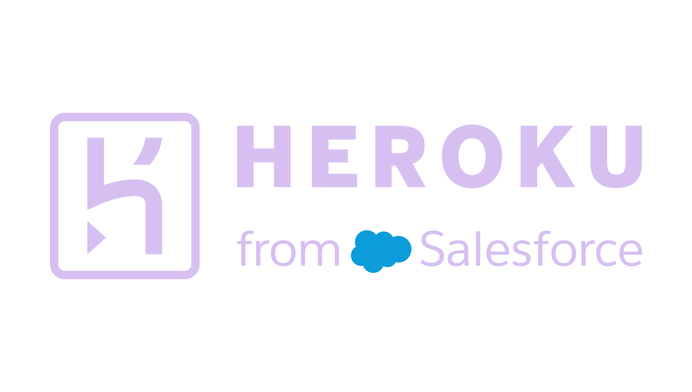
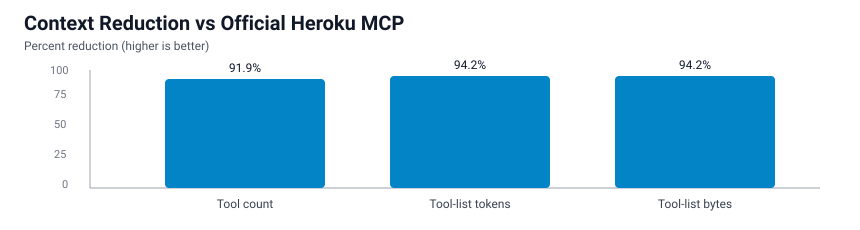
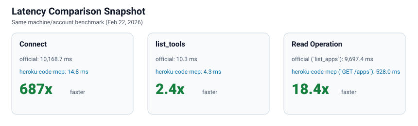

<p align="center">
  
</p>

# Heroku Code MCP

> A compact MCP server for the Heroku Platform API using a Code Mode pattern: `search` + `execute` + `auth_status`.

<!-- mcp-name: io.github.dsouzaAnush/heroku-code-mcp -->

Heroku Code MCP gives agent clients a small, token-efficient control surface for Heroku operations. Pair it with [Heroku Skills](https://github.com/dsouzaAnush/heroku-skills) when you want workflow guidance, safety checks, and Heroku product context alongside live API tools.

Design references:
- [Cloudflare Code Mode MCP](https://blog.cloudflare.com/code-mode-mcp/)
- [Anthropic: Building Effective Agents](https://www.anthropic.com/engineering/building-effective-agents)

## Quick Start

Default MCP URL: `http://127.0.0.1:3000/mcp`

```bash
git clone https://github.com/dsouzaAnush/heroku-code-mcp.git
cd heroku-code-mcp
npm install
npm run build
npm test
```

Seed auth from the Heroku CLI:

```bash
heroku auth:whoami
npm run seed:token
```

Start the server:

```bash
TOKEN_STORE_PATH=./data/tokens.integration.json \
TOKEN_ENCRYPTION_KEY_BASE64="<seed-output-key>" \
PORT=3000 HOST=127.0.0.1 npm run dev
```

Smoke test:

```bash
curl -sS http://127.0.0.1:3000/healthz
MCP_URL=http://127.0.0.1:3000/mcp USER_ID=default npm run smoke:mcp
```

## Slackbot MCP Client

Slackbot requires a remote Streamable HTTP endpoint and signs each request. Run
this server in `slack_identity` mode to verify those signatures and authorize
tool calls from an allowlisted Slack workspace or Enterprise org:

```bash
MCP_AUTH_MODE=slack_identity \
SLACK_SIGNING_SECRET="<Slack app signing secret>" \
SLACK_ALLOWED_ENTERPRISE_IDS="E0123456789" \
HEROKU_API_TOKEN="<Heroku service token>" \
ALLOW_WRITES=true \
SLACK_DEPLOY_ALLOWED_APPS="my-demo-app" \
SLACK_DEPLOY_ALLOWED_REPOS="owner/public-repo" \
npm start
```

Use [`slack/manifest.json`](slack/manifest.json) to create the Slack app. Its MCP
server URL points at the deployed `/mcp` endpoint and uses Slack identity auth.

Slack mode deliberately omits the generic `execute` tool by default. It exposes:

- `auth_status`: verifies that the allowlisted Slack caller can use the configured
  Heroku service credential without returning that credential.
- `search`: read-only Heroku Platform API operation discovery.
- `list_apps`: lists the Heroku app names visible to the authenticated service
  account, with non-secret identifiers and status metadata.
- `deploy_github_repo`: starts a Heroku Build API deployment, restricted to the
  app and public GitHub repository allowlists above.
- `get_deployment_status`: checks the resulting Heroku build by ID.

Set `SLACK_ALLOWED_USER_IDS` for an additional per-user allowlist. The service
refuses Slack identity mode unless a signing secret and at least one team or
Enterprise-org ID are configured. `SLACK_ENABLE_GENERIC_EXECUTE=true` restores
the broad Platform API executor, but is not recommended for a shared Slack demo.

## Deploy to Heroku

This repo is ready for Heroku Git deployment as a Node web dyno. The hosted MCP endpoint is:

```text
https://<app-name>.herokuapp.com/mcp
```

Create the app and set the required production config:

```bash
heroku apps:create <app-name>
heroku git:remote -a <app-name>

TOKEN_KEY="$(node -e 'console.log(require("crypto").randomBytes(32).toString("base64"))')"
WRITE_SECRET="$(openssl rand -hex 32)"
MCP_SECRET="$(openssl rand -hex 32)"

heroku config:set \
  PUBLIC_BASE_URL="https://<app-name>.herokuapp.com" \
  TOKEN_ENCRYPTION_KEY_BASE64="$TOKEN_KEY" \
  WRITE_CONFIRMATION_SECRET="$WRITE_SECRET" \
  MCP_AUTH_TOKEN="$MCP_SECRET" \
  ALLOW_WRITES=false \
  -a <app-name>
```

For OAuth-backed `execute` calls, create a Heroku OAuth client with this callback URL:

```text
https://<app-name>.herokuapp.com/oauth/callback
```

Then set:

```bash
heroku config:set \
  HEROKU_OAUTH_CLIENT_ID="<client-id>" \
  HEROKU_OAUTH_CLIENT_SECRET="<client-secret>" \
  -a <app-name>
```

Deploy and verify:

```bash
git push heroku main
curl -sS "https://<app-name>.herokuapp.com/healthz"
MCP_URL="https://<app-name>.herokuapp.com/mcp" \
  MCP_AUTH_TOKEN="$MCP_SECRET" \
  USER_ID=default \
  npm run smoke:mcp
```

When adding the hosted server to an MCP client, include:

```text
Authorization: Bearer <MCP_AUTH_TOKEN>
```

Before npm publication, the package can also run from GitHub:

```bash
HOST=127.0.0.1 PORT=3333 \
TOKEN_STORE_PATH="$HOME/.heroku-code-mcp/tokens.json" \
TOKEN_ENCRYPTION_KEY_BASE64="<base64-32-byte-key>" \
WRITE_CONFIRMATION_SECRET="<random-secret>" \
npx -y github:dsouzaAnush/heroku-code-mcp
```

## Install in Agent Clients

###  Claude Code

Install the companion plugin for skills plus MCP wiring:

```bash
claude plugin marketplace add dsouzaAnush/heroku-plugin
claude plugin install heroku@heroku-plugin
claude plugin enable heroku@heroku-plugin
```

Or add the running MCP server directly:

```bash
claude mcp add \
  --transport http \
  --scope local \
  heroku-code-mcp \
  http://127.0.0.1:3000/mcp \
  --header "x-user-id: default"
```

###  Claude Desktop

Use the HTTP endpoint directly when supported:

```json
{
  "mcpServers": {
    "heroku-code-mcp": {
      "type": "http",
      "url": "http://127.0.0.1:3000/mcp",
      "headers": {
        "x-user-id": "default"
      }
    }
  }
}
```

For Desktop builds that expect stdio servers, bridge through `mcp-remote`:

```json
{
  "mcpServers": {
    "heroku-code-mcp": {
      "command": "npx",
      "args": ["-y", "mcp-remote", "http://127.0.0.1:3000/mcp", "--allow-http", "--header", "x-user-id:default"]
    }
  }
}
```

Build a `.mcpb` bundle with:

```bash
npm run build:mcpb
```

###  Codex

Codex uses [Heroku Plugin](https://github.com/dsouzaAnush/heroku-plugin) for skills and optional MCP wiring:

```bash
codex plugin marketplace add dsouzaAnush/heroku-plugin --ref main
```

Enable `heroku-plugin@heroku-plugin` in the Codex Plugins tab, or add:

```toml
[plugins."heroku-plugin@heroku-plugin"]
enabled = true
```

Run this MCP server on `http://127.0.0.1:3333/mcp` when you want live Heroku API tools through the plugin.

###  Cursor

```bash
git clone https://github.com/dsouzaAnush/heroku-plugin.git
cursor agent --plugin-dir heroku-plugin
```

Add the MCP server to `~/.cursor/mcp.json` or project-local `.cursor/mcp.json`:

```json
{
  "mcpServers": {
    "heroku-code-mcp": {
      "type": "streamable-http",
      "url": "http://127.0.0.1:3333/mcp",
      "headers": {
        "x-user-id": "default"
      }
    }
  }
}
```

### Other MCP Clients

Use streamable HTTP:

```json
{
  "mcpServers": {
    "heroku-code-mcp": {
      "transport": "streamable_http",
      "url": "http://127.0.0.1:3000/mcp",
      "headers": {
        "x-user-id": "default"
      }
    }
  }
}
```

Or bridge to stdio:

```json
{
  "mcpServers": {
    "heroku-code-mcp": {
      "command": "npx",
      "args": ["-y", "mcp-remote", "http://127.0.0.1:3000/mcp", "--allow-http", "--header", "x-user-id:default"]
    }
  }
}
```

## How It Works

| Tool | What it does | Why it exists |
| --- | --- | --- |
| `auth_status` | Reports whether the caller is authenticated with Heroku | Lets agents branch cleanly before API work |
| `search` | Ranks Heroku operations from schema and docs context | Avoids exposing dozens of endpoint-shaped tools up front |
| `execute` | Validates params/body and calls the selected Heroku operation | Gives one deterministic execution path |

Typical flow:

1. Call `auth_status`.
2. Call `search` with natural language intent.
3. Choose one `operation_id`.
4. Call `execute` with `path_params`, `query_params`, and `body`.
5. For writes, run `dry_run=true`, then replay with `confirm_write_token` and `ALLOW_WRITES=true`.

Examples:

```json
{
  "query": "list apps",
  "limit": 5
}
```

```json
{
  "operation_id": "GET /apps"
}
```

```json
{
  "operation_id": "PATCH /apps/{app_identity}",
  "path_params": {
    "app_identity": "my-app"
  },
  "body": {
    "maintenance": true
  },
  "dry_run": true
}
```

## Safety and Configuration

Mutations (`POST`, `PATCH`, `PUT`, `DELETE`) are blocked by default. To allow a write, set `ALLOW_WRITES=true`, request a dry run, and replay with the returned `confirm_write_token`. Sensitive headers and body fields are redacted.

Key env vars:
- `ALLOW_WRITES`
- `REQUEST_TIMEOUT_MS`
- `MAX_RETRIES`
- `CATALOG_CACHE_PATH`
- `READ_CACHE_TTL_MS`
- `EXECUTE_MAX_BODY_BYTES`
- `EXECUTE_BODY_PREVIEW_CHARS`

Full example: `.env.example`

## Benchmarks

Benchmarks were captured on February 22, 2026 on the same machine and account for both implementations.

| Metric | `heroku-code-mcp` | official Heroku MCP | Delta |
| --- | ---: | ---: | ---: |
| Tool count | 3 | 37 | 91.9% lower |
| Tool-list payload bytes | 1,469 | 25,500 | 94.2% lower |
| Tool-list approx tokens | 368 | 6,375 | 94.2% lower |
| Connect avg | 14.8 ms | 10,168.7 ms | 687x faster |
| `list_tools` avg | 4.3 ms | 10.3 ms | 2.4x faster |
| Read op avg | 528.0 ms (`execute GET /apps`) | 9,697.4 ms (`list_apps`) | 18.4x faster |

Charts:
- 
- 

Full methodology and artifacts live in [`BENCHMARKS.md`](BENCHMARKS.md) and `benchmarks/results/`.

## Development and Release

Validate locally:

```bash
npm run build
npm test
npm run validate:server
npm run publish:dry-run
```

This repo uses free GitHub Actions:
- `validate.yml` runs build, tests, `server.json` validation, and npm pack dry-run on PRs and pushes to `main`.
- `release.yml` runs on `v*` tags, builds the `.mcpb`, updates release `server.json`, creates or updates the GitHub Release, and publishes to the MCP Registry through GitHub OIDC.
- Dependabot checks npm and GitHub Actions dependencies weekly.

Publish manually when needed:

```bash
npm publish --access public
mcp-publisher login github
mcp-publisher publish server.json
```

For CI-based npm publishing, configure npm trusted publishing for repo `dsouzaAnush/heroku-code-mcp` and workflow `release.yml`, then run the release workflow with `publish_npm=true`.

## Repository Layout

- `src/schema/*`: ingestion, operation normalization, and cache
- `src/search/*`: search index and ranking
- `src/execute/*`: validation and Heroku API execution
- `src/auth/*`: OAuth and encrypted token storage
- `tests/*`: catalog, search, and execute tests
- `benchmarks/results/*`: benchmark artifacts
- `server.json`: MCP Registry metadata

## Brand and Troubleshooting

This repo includes the official Heroku wordmark and mark under [`assets`](assets). Use them according to the [Heroku Brand Guidelines](https://devcenter.heroku.com/articles/heroku-brand-guidelines).

Common fixes:
- MCP Inspector connection error: confirm URL `http://127.0.0.1:3000/mcp` and server health.
- `AUTH_REQUIRED`: seed a token or complete OAuth.
- Write blocked: confirm `ALLOW_WRITES=true` and send the dry-run confirmation token.
- Large response body: narrow query scope or lower output caps.
